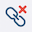

#  LinkCheckr

A Google Chrome extension that checks visible links on any webpage and flags broken ones with a red ❌ icon.

## Prerequisites

- Node/NPM

## How it works

1. The extension injects a content script into every webpage you visit.
2. The content script uses the `Mozilla Readability` library to parse the page and extract its main content.
3. It scans all visible anchor (`<a>`) elements within the parsed content and tracks them using an `IntersectionObserver` to detect when they come into view.
4. For each link, the script checks if the link has already been processed using a cache stored in Chrome's local storage.
5. If the link is not cached, the content script sends a message to the background script to validate the link's status.
6. The background script performs a `GET` request to the link's URL (with `bytes=0-0` range header for retrieving partial content) to check its HTTP status code:
   - Links with non-2xx status codes (e.g., 404) are flagged as broken.
   - Links with certain schemes (e.g., `mailto:`, `tel:`, `data:`) or fragment identifiers (`#`) are treated as valid without making a request.
   - Links with fetch errors are ignored.
7. The content script updates the cache with the link's status and dynamically displays a red ❌ icon next to broken links on the webpage.
8. The extension enforces a maximum cache size to ensure efficient storage management.
9. As you scroll or new links appear on the page, the extension continues to validate and flag links dynamically.

## Local Testing

- Inside the project folder, run:

  ```bash
  npm run watch
  ```

- Open `chrome://extensions`
- Check the `Developer mode` checkbox
- Click on the `Load unpacked` extension button
- Select the folder `linkcheckr-chrome-extension/build`
- Navigate to any web page and as you scroll through, you should start seeing ❌ icon next to any broken link

## Build for publishing on Chrome Web Store

- Inside the project folder, run:

  ```bash
  npm run build && npm run pack
  ```

## Contribution

Suggestions and pull requests are welcomed!

---

This project was bootstrapped with [Chrome Extension CLI](https://github.com/dutiyesh/chrome-extension-cli)
